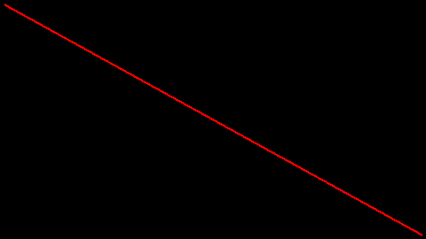
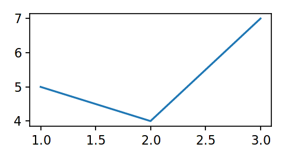

.. _drawing:

Drawing: Canvas Types & Backends
================================

``bewegung`` offers a set of "backends" for drawing on canvases. A specific canvas can be selected with the ``Video.canvas`` method. Full access to the inventory of backends and all of their functionality is provided through a ``backends`` dictionary.

Canvas Factories: ``Video.canvas``
----------------------------------

The ``Video.canvas`` method is typically used to configure a layer. It returns a "factory", i.e. a special function, which can be called to generate new pre-configured canvases of a certain type.

.. code:: python

    from bewegung import Video

    v = Video(width = 1920, height = 1080, seconds = 10.0)

    canvas_factory = v.canvas(backend = 'drawingboard')
    canvas_a = canvas_factory() # produce a new canvas
    canvas_b = canvas_factory() # produce yet another new canvas

In the context of a layer's configuration, the use of ``Video.canvas`` looks as follows. Note that ``DrawingBoard`` is in fact the default canvas, so it usually does not have to be explicitly selected. A new, pre-configured canvas of the requested type is fed into the layer method for every individual video frame.

.. code:: python

    from bewegung import Video

    v = Video(width = 1920, height = 1080, seconds = 10.0)

    @v.sequence()
    class Foo:

        @v.layer(canvas = v.canvas(backend = 'drawingboard'))
        def bar(self, canvas): # a new canvas is generated and passed once per frame
            return canvas

Parameters of the ``Video.canvas`` method other than ``backend``, i.e. the name of the selected backend, are usually forwarded to the underlying library. However, the various backends of ``bewegung`` may fill certain parameters with reasonable defaults or fix inconsistencies that can be problematic in the context of generating videos. See chapters on individual backends below.

Inventory of ``backends``
-------------------------

All backends can be accessed via the ``backends`` dictionary, which represents the inventory of backends.

.. code:: ipython

    >>> from bewegung import backends
    >>> backends.keys()
    dict_keys(['drawingboard', 'pillow', 'datashader', 'cairo', 'matplotlib'])
    >>> [backend for backend in backends.values()]
    [<DrawingBoardBackend>, <PillowBackend>, <DatashaderBackend>, <CairoBackend>, <MatplotlibBackend>]

Backends are "lazy" objects. They only import the underlying library if actually used. For most intents and purposes, working with ``Video.canvas`` is sufficient. Further details about the common structure of backends are provided in the :ref:`sections on custom backends <custombackends>`.

Backend: ``DrawingBoard``
-------------------------

Foo bar.

Backend: ``pycairo``
--------------------

The ``pycairo`` backend allows to generate pre-configured ``ImageSurface`` objects, see `pycairo documentation`_.

.. _pycairo documentation: https://pycairo.readthedocs.io/en/latest/reference/surfaces.html?highlight=ImageSurface#cairo.ImageSurface

.. code:: python

    import cairo
    from bewegung import Video

    v = Video(width = 480, height = 270, seconds = 1.0)

    @v.sequence()
    class Foo:

        @v.layer(canvas = v.canvas(backend = 'cairo'))
        def bar(self, canvas): # a pyrairo ImageSurface, mode ARGB32

            ctx = cairo.Context(canvas)

            ctx.move_to(5, 5)
            ctx.line_to(v.width - 5, v.height - 5)
            ctx.set_source_rgba(1, 0, 0, 1)
            ctx.set_line_width(3)
            ctx.stroke()

            return canvas

    v.reset()
    v.render_frame(v.time(0))

.. image:: _static/backend_cairo.png
  :width: 480
  :alt: Cairo output

Similar to ``cairo.ImageSurface``, the function call ``v.canvas(backend = 'cairo')`` accepts the following additional keyword arguments:

- ``format``, by default ``cairo.FORMAT_ARGB32``. If a format other than ARGB32 is specified, the layer method is supposed to return a Pillow Image object of mode ```'RGBA'`` instead of an ``ImageSurface`` object, i.e. in this case the conversion to Pillow's image format is left to the user. Alternatively, the user may also convert the non-ARGB32 ``ImageSurface`` object to an ARGB32 ``ImageSurface`` object before returning it from the layer method.
- ``width``, width of the video by default
- ``height``, height of the video by default

Backend: ``Pillow``
-------------------

Because ``bewegung`` is literally built around ``Pillow``, the ``Pillow`` backend is by far the most simple one in the collection. For further details, please consult the `documentation of Pillow`_.

.. _documentation of Pillow: https://pillow.readthedocs.io

.. code:: python

    from PIL import ImageDraw
    from bewegung import Video

    v = Video(width = 480, height = 270, seconds = 1.0)

    @v.sequence()
    class Foo:

        @v.layer(canvas = v.canvas(backend = 'pillow'))
        def bar(self, canvas): # a Pillow Image, mode RGBA

            draw = ImageDraw.Draw(canvas)
            draw.line(
                ((5, 5), (v.width - 5, v.height - 5)),
                fill = (255, 0, 0, 255), width = 3,
            )

            return canvas

    v.reset()
    v.render_frame(v.time(0))



Similar to ``PIL.Image.new``, the function call ``v.canvas(backend = 'pillow')`` accepts the following additional keyword arguments:

- ``mode``, by default ``'RGBA'``. If a format other than ``'RGBA'`` is specified, the user has to convert the Image to ``'RGBA'`` before returning it from the layer method.
- ``size``, a tuple of width and height. Width and height of the video by default.
- ``color``, a background color. Uses ``Pillow``'s default, black.
- ``width``, mapped to ``size`` if provided together with ``height``.
- ``height``, mapped to ``size`` if provided together with ``width``.

Backend: ``datashader``
-----------------------

The ``datashader`` package is a high-performance graphics pipeline for visualizing very large quantities of data. For further details, please consult the `documentation of datashader`_.

.. _documentation of datashader: https://datashader.org/

.. code:: python

    import numpy as np
    import pandas as pd
    import datashader.transfer_functions as tf
    from bewegung import Video

    v = Video(width = 480, height = 270, seconds = 1.0)

    @v.sequence()
    class Foo:

        @v.layer(
            canvas = v.canvas(
                backend = 'datashader',
                x_range = (-9.6, 9.6),
                y_range = (-5.4, 5.4),
            )
        )
        def bar(self, canvas): # a datashader canvas object

            points = 100000
            df = pd.DataFrame(dict(
                x = np.random.normal(size = points),
                y = np.random.normal(size = points),
            ))

            agg = canvas.points(df, 'x', 'y')
            img = tf.shade(agg, cmap = ['lightblue', 'darkblue'], how = 'log')

            return img # a datashader.transfer_functions.Image object

    v.reset()
    v.render_frame(v.time(0))

.. image:: _static/backend_datashader.png
  :width: 480
  :alt: Datashader output

Similar to ``datashader.Canvas``, the function call ``v.canvas(backend = 'datashader')`` accepts the following additional keyword arguments:

- ``plot_width``, width of the video by default
- ``plot_height``, height of the video by default
- ``x_range``, by default ``None``
- ``y_range``, by default ``None``
- ``x_axis_type``, by default ``'linear'``
- ``y_axis_type``, by default ``'linear'``
- ``width``, mapped to ``plot_width``
- ``height``, mapped to ``plot_height``

Layer methods are expected to return ``datashader.transfer_functions.Image`` objects or, alternatively, Pillow Image objects. If a ``datashader.transfer_functions.Image`` object is returned, ``bewegung`` will mirror the image along the x-axis, i.e. the y-axis will be flipped. This makes the output consistent with ``Pillow`` and ``pycairo``, were the y-axes is positive downwards. The flip can be avoided by manually converting the image to a Pillow Image object before returning, i.e. ``return img.as_pil()`` in the above example.

Backend: ``matplotlib``
-----------------------

The ``matplotlib`` library is a - if not the - classic plotting package in the Python ecosystem. For further details, please consult the `documentation of matplotlib`_. A good basic introduction can also be found in the `Python Data Science Handbook`_ (2016), chapter 4, by `Jake VanderPlas`_. The author has made the `manuscript freely available in the form of Jupyter notebooks on Github`_.

.. _documentation of matplotlib: https://matplotlib.org/contents.html
.. _Python Data Science Handbook: https://www.worldcat.org/search?q=isbn:9781491912058
.. _Jake VanderPlas: https://twitter.com/jakevdp
.. _manuscript freely available in the form of Jupyter notebooks on Github: https://github.com/jakevdp/PythonDataScienceHandbook

.. code:: python

    from bewegung import Video

    v = Video(width = 480, height = 270, seconds = 1.0)

    @v.sequence()
    class Foo:

        @v.layer(
            canvas = v.canvas(
                backend = 'matplotlib',
                facecolor = '#FFFFFFFF',
                dpi = 150,
            )
        )
        def bar(self, canvas): # a matplotlib figure object

            ax = canvas.subplots()
            ax.plot([1, 2, 3], [5, 4, 7])

            return canvas

    v.reset()
    v.render_frame(v.time(0))



Similar to ``matplotlib.pyplot.figure``, the function call ``v.canvas(backend = 'matplotlib')`` accepts the following additional keyword arguments, among others (see documentation of `matplotlib.pyplot.figure`_ and `matplotlib.figure.Figure`_):

.. _matplotlib.pyplot.figure: https://matplotlib.org/api/_as_gen/matplotlib.pyplot.figure.html#matplotlib.pyplot.figure
.. _matplotlib.figure.Figure: https://matplotlib.org/api/_as_gen/matplotlib.figure.Figure.html#matplotlib.figure.Figure

- ``dpi``, resolution or *dots per inch*. 300 by default.
- ``figsize``, a tuple of width and height *in inches*. Width and height of the video by default, converted to inches based on the value of ``dpi``.
- ``width``, width *in pixels*. Mapped to ``figsize`` if provided together with ``height``. Converted to inches based on the value of ``dpi``.
- ``height``, height *in pixels*. Mapped to ``figsize`` if provided together with ``width``. Converted to inches based on the value of ``dpi``.
- ``tight_layout``, by default ``True``.
- ``facecolor``, a background color.
- ``background_color``, mapped to ``facecolor``. Accepts ``bewegung.Color`` objects.
- ``managed``, a boolean, by default ``True``. This value indicates whether the the ``matplotlib.figure.Figure`` object is "managed" by ``bewegung``. If ``True``, ``bewegung`` will close, i.e. destroy, a figure that is returned by a layer method.

Layer methods are expected to return ``matplotlib.figure.Figure`` objects. By default, ``bewegung`` will "manage" them for saving resources, i.e. the returned ``matplotlib.figure.Figure`` objects are automatically closed once returned.

.. _acceleratingmatplotlib:

Accelerating ``matplotlib``
~~~~~~~~~~~~~~~~~~~~~~~~~~~

Foo bar.

.. _custombackends:

Defining & Registering Custom Backends
--------------------------------------

Foo bar.

Demo backend with numpy ...

Cross-Backend Abstraction: Colors
---------------------------------

Foo bar.
