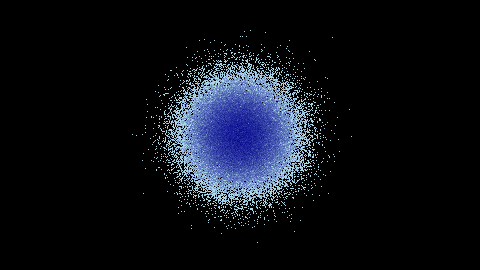

.. _datashader:

Backend: ``datashader``
=======================

The ``datashader`` package is a high-performance graphics pipeline for visualizing very large quantities of data. For further details, please consult the `documentation of datashader`_.

.. _documentation of datashader: https://datashader.org/

.. code:: python

    import numpy as np
    import pandas as pd
    import datashader.transfer_functions as tf
    from bewegung import Video

    v = Video(width = 480, height = 270, seconds = 1.0)

    @v.sequence()
    class Foo:

        @v.layer(
            canvas = v.canvas(
                backend = 'datashader',
                x_range = (-9.6, 9.6),
                y_range = (-5.4, 5.4),
            )
        )
        def bar(self, canvas): # a datashader canvas object

            points = 100000
            df = pd.DataFrame(dict(
                x = np.random.normal(size = points),
                y = np.random.normal(size = points),
            ))

            agg = canvas.points(df, 'x', 'y')
            img = tf.shade(agg, cmap = ['lightblue', 'darkblue'], how = 'log')

            return img # a datashader.transfer_functions.Image object

    v.reset()
    v.render_frame(v.time(0))

Similar to ``datashader.Canvas``, the function call ``v.canvas(backend = 'datashader')`` accepts the following additional keyword arguments:

- ``plot_width``, width of the video by default
- ``plot_height``, height of the video by default
- ``x_range``, by default ``None``
- ``y_range``, by default ``None``
- ``x_axis_type``, by default ``'linear'``
- ``y_axis_type``, by default ``'linear'``
- ``width``, mapped to ``plot_width``
- ``height``, mapped to ``plot_height``

Layer methods are expected to return ``datashader.transfer_functions.Image`` objects or, alternatively, Pillow Image objects.

.. warning::

    If a ``datashader.transfer_functions.Image`` object is returned, ``bewegung`` will mirror the image along the x-axis, i.e. the y-axis will be flipped. This makes the output consistent with ``Pillow`` and ``pycairo``, were the y-axis is positive downwards. The flip can be avoided by manually converting the image to a Pillow Image object before returning, i.e. ``return img.as_pil()`` in the above example.
