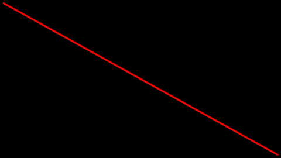

.. _drawingboard:

Backend: ``DrawingBoard``
=========================

The ``DrawingBoard`` backend provides relatively easy facilities for drawing lines, circles, other geometric primitives, text and SVGs. It is not meant for complex drawings or performance. A detailed :ref:`description of its API <drawingboardapi>` is provided below. ``DrawingBoard`` is essentially a wrapper around ``cairo``, ``Pango`` and ``rsvg``. Besides, ``bewegung`` also offers an explicit :ref:`cairo backend <backendcairo>`. If no backend is specified, layers will typically fall back to ``DrawingBoard``. A simple example using ``DrawingBoard`` looks as follows:

.. code:: python

    from bewegung import Video, Vector2D, Color

    v = Video(width = 480, height = 270, seconds = 1.0)

    @v.sequence()
    class Foo:

        @v.layer(canvas = v.canvas(backend = 'drawingboard'))
        def bar(self, canvas): # a DrawingBoard object

            canvas.draw_polygon(
                Vector2D(5, 5), Vector2D(v.width - 5, v.height - 5),
                line_width = 3,
                line_color = Color(255, 0, 0, 255),
            )

            return canvas

    v.reset()
    v.render_frame(v.time(0))

The function call ``v.canvas(backend = 'drawingboard')`` accepts additional keyword arguments, which are passed on to the :ref:`DrawingBoard constructor <drawingboardapi>`. By default, the canvas size is set to the width and height of the video.

.. _drawingboardapi:

The ``DrawingBoard`` Class
--------------------------

The ``DrawingBoard`` class makes use of :ref:`vectors <vectors>` and :ref:`colors <colors>`.

.. autoclass:: bewegung.drawingboard.DrawingBoard
    :members:
    :private-members:

.. note::

    The ``DrawingBoard`` class can be imported from ``bewegung.drawingboard``.
