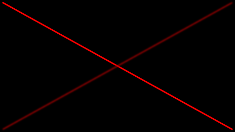

.. _effects:

Effects
=======

Effects can be applied to :ref:`layers <layer_tasks>` by decorating layer methods within :ref:`sequence classes <sequences>`. Layers can be combined with an arbitrary number of effects. From a functional point of view, effects post-process images generated by layer tasks. There is a set of readily available effects in ``bewegung``. However, new custom effects can be easily added as well.

Available Effects
-----------------

.. autoclass:: bewegung.FadeInEffect

.. autoclass:: bewegung.FadeOutEffect

Defining Custom Effects
-----------------------

Custom effects are implemented by deriving from :class:`bewegung.EffectBase`. Once derived, they can be directly applied to layers.

The ``EffectBase`` Class
~~~~~~~~~~~~~~~~~~~~~~~~

.. autoclass:: bewegung.EffectBase
    :members:
    :private-members:

.. note::

    Similar to prepare task methods and layer task methods, the ``apply`` method in classes derived from :class:`bewegung.EffectBase` can :ref:`request parameters on demand <requesting_parameters>`. See :meth:`bewegung.EffectBase.apply_` for details.

A Minimal Effect based on ``ImageFilter``
~~~~~~~~~~~~~~~~~~~~~~~~~~~~~~~~~~~~~~~~~

The following example illustrates how to build a custom effect around a filter function from the ``ImageFilter`` module (part of ``pillow``).

.. code:: python

    from PIL import Image, ImageFilter
    from bewegung import Video, Vector2D, Color, EffectBase

    class BlurEffect(EffectBase): # derive from EffectBase

        def __init__(self, radius: float):

            if radius < 0:
                raise ValueError('radius must be positive or zero')

            super().__init__()
            self._filter = ImageFilter.GaussianBlur(radius) # setup filter

        def apply(self, cvs: Image.Image) -> Image.Image: # request nothing but the image

            return cvs.filter(self._filter) # apply filter to image and return

    v = Video(width = 480, height = 270, seconds = 1.0)

    @v.sequence()
    class Foo:

        @v.layer()
        def lineA(self, canvas): # layer without effect

            canvas.draw_polygon(
                Vector2D(5, 5), Vector2D(v.width - 5, v.height - 5),
                line_width = 3,
                line_color = Color(255, 0, 0, 255),
            )

            return canvas

        @BlurEffect(radius = 2.0) # decorate layer with filter
        @v.layer()
        def lineB(self, canvas): # layer with effect

            canvas.draw_polygon(
                Vector2D(v.width - 5, 5), Vector2D(5, v.height - 5),
                line_width = 3,
                line_color = Color(255, 0, 0, 255),
            )

            return canvas

    v.reset()
    v.render_frame(v.time(0))

The :meth:`bewegung.EffectBase.apply` method is basically the only method that must be re-implemented by a custom effect. However, the constructor of this class can optionally be re-implemented if required to add parameters to an effect decorator object. In the latter case, one must not forget to call the constructor of the original underlying class (``super().__init__()``).
