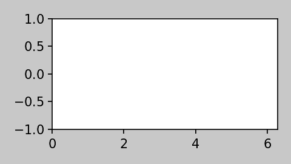

Getting Started
===============

``bewegung`` provides classes and functions for defining and rendering videos. Various drawing and plotting libraries can virtually transparently be integrated into this process. ``bewegung`` manages the composition of the video frames, in parallel if desired, and streams them to ``ffmpeg`` for video encoding.

.. _minimalexample:

Minimal Example
---------------

A video can be generated in three easy steps:

1. Creating a *video object*
2. Defining *sequences* and *layers* (via decorators)
3. *Rendering* the video

The following code snipped will create an empty, black video, 10 seconds long at 60 frames per second (fps) in `1080p`_:

.. code:: python

    from bewegung import Video

    # 1. create a video object
    v = Video(width = 1920, height = 1080, seconds = 10.0)

    # 2. define sequences
    @v.sequence()
    class Background:

        # ... and layers
        @v.layer()
        def empty(self, canvas):
            return canvas

    # 3. render the video
    v.render(video_fn = 'video.mp4')

.. _1080p: https://en.wikipedia.org/wiki/1080p

*Video objects* manage the subsequently defined components of a video. They can be understood as a thin data management structure combined with a simple scheduler. Every video can contain multiple (overlapping) *sequences*. Sequences are special, decorated classes. By default, a sequence is as long as its parent video - however, it can also be limited in length and begin at any desired time. A sequence can hold multiple *layers*. A layer is a special, decorated method within a sequence class that draws content onto a canvas and returns the "filled" canvas (i.e. the drawn image).

.. _complexexample:

Complex Example
---------------

The following code snipped will create a 10 second long animated gif-file at 30 fps in 270p with a gray background and a red "ball" (filled circle) moving from the top left corner to the bottom right corner of the image:

.. code:: python

    from multiprocessing import cpu_count
    from bewegung import (
        Video,
        Color, Vector2D,
        FadeInEffect, FadeOutEffect,
        FFmpegGifEncoder,
    )

    v = Video(
        width = 480, height = 270,
        frames = 300, # video length in frames
        fps = 30, # set output to 30 fps
    )

    @v.sequence() # from start to finish of the video
    class Background:

        @v.layer(
            zindex = v.zindex.on_bottom(), # at the bottom of the stack
            canvas = v.canvas(background_color = Color(26, 26, 26)), # gray
        )
        def empty(self, canvas):
            return canvas # nothing to do, canvas remains empty

    @v.sequence(
        start = v.time_from_seconds(1.0), # start one second into the video
        stop = v.time_from_seconds(-1.0), # stop one second before end of video
    )
    class SomeForeground:

        @FadeInEffect(v.time_from_seconds(4.0)) # fade layer in for 4 seconds
        @FadeOutEffect(v.time_from_seconds(2.0)) # fade layer out for 2 seconds
        @v.layer(
            zindex = v.zindex.on_top(), # on top of the stack
            canvas = v.canvas(background_color = Color(26, 26, 26, 0)), # transparent gray
        )
        def moving_red_ball(self, canvas, reltime): # request relative time within sequence
            factor = reltime / self.length
            canvas.draw_filledcircle(
                point = Vector2D(factor * v.width, factor * v.height),
                r = 10,
                fill_color = Color(255, 0, 0),
                )
            return canvas

    v.render(
        video_fn = 'video.gif',
        processes = cpu_count(), # render video frames in parallel
        encoder = FFmpegGifEncoder(), # export as gif file
    )

The output looks as follows:

Compared to the initial minimal example, the above complex example contains two :ref:`sequences <sequences>` with one :ref:`layer <layer_tasks>` each. The :ref:`video <video>`, the layers and the sequences are a lot more configured. The video for instance is not defined based on its length in seconds. Instead, the number of frames is provided. Besides, the video is not using ``bewegung``'s default frame rate of 60 fps but 30 fps instead.

The "empty" layer in the "Background" sequence receives a background :ref:`color <colors>`, a dark gray tone. It is provided with an explicit z-index at the bottom of the stack of layers. The "SomeForeground" sequence begins one second into the video and ends one second before the end of the video. The "moving_red_ball" layer has a transparent background color so the "empty" layer from the "Background" sequence becomes visible. It is also provided with an explicit z-index - this time at the top of the stack of layers. In addition, the "moving_red_ball" layer is decorated with *video effects*, making it to fade in and out.

The video frames are *rendered in parallel*. The ``processes`` parameter of the :meth:`bewegung.Video.render` method defines the number of parallel rendering processes. It is set to the `number of logical cores`_ of the computer's CPU(s). ``bewegung`` evaluates every layer once per video frame and composes all layers to an image - the actual video frame. Because of the parallel nature of ``bewegung``, the *generation of frames may occur out-of-order*. However, the video frames are always forwarded to the video encoder in the right order.

Videos can be encoded with different :ref:`encoders <encoders>`. By default, ``bewegung`` encodes to ``H.264``. In the above example, a gif-encoder is used instead - producing an animated gif-file.

.. _number of logical cores: https://docs.python.org/3/library/multiprocessing.html#multiprocessing.cpu_count

Prepare Tasks
-------------

In may be necessary to prepare or compute data prior to drawing onto a canvas. It may even be the case that multiple layers rely on the same data, which has to be prepared once per video frame. This is where *prepare tasks* become useful. They work very much like layers. There is a special decorator for indicating them. :ref:`Prepare tasks <prepare_tasks>` can also be ordered in a system similar to the z-index of layers, the prepare-order (``preporder``).

.. note::

    All prepare tasks are evaluated once per video frame and **before** the first layer is drawn.

.. code:: python

    from multiprocessing import cpu_count
    from bewegung import Video, Color, Vector2D

    v = Video(width = 1920, height = 1080, seconds = 10.0)

    @v.sequence()
    class Background:

        @v.layer(canvas = v.canvas(background_color = Color(26, 26, 26)))
        def empty(self, canvas):
            return canvas

    @v.sequence()
    class SomeForeground:

        def __init__(self):
            self._factor = None # initialize variable which will eventually hold data

        @v.prepare(
            preporder = v.preporder.on_bottom(), # task comes first ("bottom of stack")
        ) # prepare task decorator
        def compute_data(self, reltime): # prepare task method, requesting relative time within sequence
            self._factor = reltime / self.length # prepare data

        @v.layer(canvas = v.canvas(background_color = Color(26, 26, 26, 0)))
        def moving_red_ball(self, canvas): # requesting a canvas
            canvas.draw_filledcircle(
                point = Vector2D(
                    self._factor * v.width, # use data
                    self._factor * v.height, # use data
                ),
                r = 10,
                fill_color = Color(255, 0, 0),
                )
            return canvas

    v.render(video_fn = 'video.mp4', processes = cpu_count())

In the above example, a single prepare task is defined. It computes a "factor" which is eventually picked up by the "moving_red_ball" layer. The "SomeForeground" sequence class' constructor is used to initialize the "factor" variable.

Rendering Frames as Images instead of Videos
--------------------------------------------

For debugging and development, it can be very useful to be able to selectively render individual frames into image files or interactively work with the resulting image objects.

.. code:: python

    from bewegung import Video

    v = Video(width = 1920, height = 1080, seconds = 10.0)

    @v.sequence()
    class Background:

        @v.layer()
        def empty(self, canvas):
            return canvas

    v.reset() # reset video object before frames can be saved!
    v.render_frame(
        time = v.time(45), # frame number 45
        frame_fn = 'some_frame.png', # save to location as PNG
        )
    pillow_image_object = v.render_frame(
        time = v.time_from_seconds(1.0), # frame at 1 second
        ) # returns a Pillow.Image object

Instead of calling :meth:`bewegung.Video.render`, the video object can be manually *reset* by calling :meth:`bewegung.Video.reset`. A reset is usually taken care of by the video render method, but if individual frames are desired instead, it has to be called at least once before the first video frame is generated. Once this is done, frames can be selected based on their time and rendered with :meth:`bewegung.Video.render_frame`. This method can both directly store the frame into a file and return it as a ``Pillow.Image`` object, see `Pillow documentation`_.

.. note::

    Reset video objects (:meth:`bewegung.Video.reset`) at least once before rendering individual frames (:meth:`bewegung.Video.render_frame`)!

.. _Pillow documentation: https://pillow.readthedocs.io/en/stable/reference/Image.html#the-image-class

Using & Mixing Backends
-----------------------

One of ``bewegung``'s key features is its ability to work with multiple drawing and plotting systems simultaneously - the :ref:`backends <drawing>`. ``bewegung`` offers its own drawing system, :ref:`DrawingBoard <drawingboard>`, which is used both in the :ref:`minimal <minimalexample>` and in the :ref:`complex example <complexexample>` at the beginning of this chapter. It is based on ``pycairo``. ``pycairo`` can of cause also be used directly. In addition, ``bewegung`` directly integrates ``matplotlib``, ``datashader`` and ``Pillow``. The mentioned libraries are referred to as *backends*. A new, :ref:`custom backend <custombackends>` can easily be added. A backend is typically chosen once per layer, although it is feasible make this process even more flexible.

.. note::

    :ref:`Backends <drawing>` are loaded (in Python-terms *imported*) on demand. If a backend is not required, the underlying library does not have to be present / installed.

.. code:: python

    from multiprocessing import cpu_count
    from math import sin, pi
    from bewegung import Video, Color, FFmpegGifEncoder

    v = Video(width = 480, height = 270, seconds = 2.0, fps = 30)

    @v.sequence()
    class SomeSequence:

        def __init__(self):
            self._x = [x * 2 * pi / len(v) for x in range(len(v))]
            self._y = [sin(x) for x in self._x]

        @v.layer(
            canvas = v.canvas(background_color = Color(200, 200, 200)),
        ) # this layer uses DrawingBoard, the default backend
        def background(self, canvas):
            return canvas

        @v.layer(
            canvas = v.canvas(
                backend = 'matplotlib', # configure layer to use matplotlib
                dpi = 150, # pass parameters to new matplotlib figures
            ),
        )
        def growing_sinwave(self,
            time,
            canvas, # this is now actually a matplotlib figure
        ):
            ax = canvas.subplots()
            ax.set_xlim(0, 2 * pi)
            ax.set_ylim(-1, 1)
            ax.plot(self._x[:time.index+1], self._y[:time.index+1])
            return canvas

    v.render(
        video_fn = 'video.gif',
        processes = cpu_count(),
        encoder = FFmpegGifEncoder(),
    )

The :meth:`bewegung.Video.canvas` method allows to specify and configure backends once per layer. Most of its parameters are passed on to the backend library unmodified. If required, ``bewegung`` fills certain parameters with reasonable defaults or fixes inconsistencies that may be problematic in the context of generating videos. For details, see :ref:`chapter on drawing <drawing>`.

.. note::

    A backend can, if necessary, alter default values of the backend's underlying library.

.. _requesting_parameters:

Requesting Parameters in Layers and Prepare Tasks
-------------------------------------------------

Both :ref:`prepare task <prepare_tasks>` methods and :ref:`layer task <layer_tasks>` methods can request information and canvases based on their actual demand. ``bewegung`` first analyzes what a method requests. It then generates the requested objects and passes them on to the prepare task or layer method.

.. code:: python

    from PIL.Image import new
    from bewegung import Video

    v = Video(width = 1920, height = 1080, seconds = 10.0)

    @v.sequence()
    class SomeSequence:

        @v.prepare()
        def prepare_task_without_request(self):
            pass

        @v.prepare()
        def prepare_task_requesting_all_possible_fields(self,
            time, # time within video
            reltime, # relative time within sequence
        ):
            pass

        @v.layer()
        def layer_without_request(self):
            return new(mode = 'RGBA', size = (v.width, v.height))

        @v.layer()
        def layer_requesting_all_possible_fields(self,
            time, # time within video
            reltime, # relative time within sequence
            canvas, # empty canvas
        ):
            pass

.. note::

    Parameters do not have to be requested in any specific order.

If the canvas object is not returned, ``bewegung`` will assume that the user has drawn onto the canvas object that was passed into the layer method. ``bewegung`` retains a reference to this canvas object internally. Only if no canvas was passed into the method and no canvas was returned by the method, an exception will be raised.

.. note::

    Layer methods do not (always) need to return a/the canvas object.

Working with Time
-----------------

Describing time within a videos is handled by special :class:`bewegung.Time` objects. They encapsulate two representations of time: An *index* representing a frame number and an actual *time in seconds*. The conversion between the two depends on the *frames per second* (*fps*). A lot of basic arithmetic is implemented for :class:`bewegung.Time` objects.

.. code:: ipython

    >>> from bewegung import Time
    >>> a = Time(index = 50, fps = 30)
    >>> print(a)
    <Time index=50 seconds=1.667s fps=30>
    >>> b = Time(index = 75, fps = 30)
    >>> c = b - a
    >>> print(c)
    <Time index=25 seconds=0.833s fps=30>
    >>> print(c.seconds, c.index, c.fps)
    0.8333333333333334 25 30
    >>> int(c)
    25
    >>> float(c)
    0.8333333333333334

Because the need of taking care of the frames per second all the time can be annoying, every :class:`bewegung.Time` and :class:`bewegung.Video` object allows to generate new :class:`bewegung.Time` objects based on its frames per second state.

.. code:: ipython

    >>> from bewegung import Time, Video
    >>> a = Time(index = 50, fps = 30)
    >>> b = a.time(75) # new time object, index == 75, fps from a
    >>> c = a.time_from_seconds(1.0) # new time object, seconds == 1.0, fps from a
    >>> print(a)
    <Time index=50 seconds=1.667s fps=30>
    >>> print(b)
    <Time index=75 seconds=2.500s fps=30>
    >>> print(c)
    <Time index=30 seconds=1.000s fps=30>
    >>> v = Video(width = 1920, height = 1080, seconds = 10.0, fps = 25)
    >>> d = v.time(40) # new time object, index == 40, fps from v
    >>> e = v.time_from_seconds(7.0) # new time object, index == 40, fps from v
    >>> print(d)
    <Time index=40 seconds=1.600s fps=25>
    >>> print(e)
    <Time index=175 seconds=7.000s fps=25>

For easily working with "accelerated" or "slowed down" time, i.e. time-lapse or slow-motion videos, ``bewegung`` also offers a :class:`bewegung.TimeScale` class.

Convenience Functionality
-------------------------

``bewegung`` includes a lot of "convenience functionality" for common tasks around video production in the context of scientific visualizations.

.. warning::

    Most of this functionality is only little optimized for speed. It is therefore not meant as a substitute for professional libraries doing those exact things.

Because many of ``bewegung``'s backends have their own interpretations of colors and color models, ``bewegung`` offers a unified :class:`bewegung.Color` class. Internally, it is based on RGBA (red, green, blue, alpha) integer values with 8 bits per channel, representing values from 0 to 255.

.. code:: ipython

    >>> from bewegung import Color
    >>> a = Color(5, 6, 7)
    >>> print(a)
    <Color r=5 g=6 b=7 a=255>
    >>> a.as_hex()
    '050607ff'
    >>> a.as_hex(alpha = False)
    '050607'
    >>> a.as_rgba_float()
    (0.0196078431372549, 0.023529411764705882, 0.027450980392156862, 1.0)
    >>> a.as_rgba_int()
    (5, 6, 7, 255)
    >>> Color.from_hex('FF0000')
    <Color r=255 g=0 b=0 a=255>

Simple vector algebra is also a rather common task, which is why ``bewegung`` offers vector classes (:class:`bewegung.Vector2D`, :class:`bewegung.Vector2Ddist`, :class:`bewegung.Vector3D`) and vector array classes (:class:`bewegung.VectorArray2D`, :class:`bewegung.VectorArray2Ddist`, :class:`bewegung.VectorArray3D`) as well as a :class:`bewegung.Matrix` and a :class:`bewegung.MatrixArray` class. While the vector classes simply hold two or three Python numbers, the vector array classes are wrappers around ``numpy`` arrays. The :class:`bewegung.Matrix` class is meant for simple tasks like rotations. A :class:`bewegung.Camera` class allows to define a "pinhole camera" in 3D space which can project 3D vectors onto a 2D plane. All linear algebra objects can carry meta data such as the absolute distance to a Camera in 3D space, which can be important for depth perception.

.. code:: ipython

    >>> from math import pi
    >>> from bewegung import Vector2D, Vector3D, Matrix, Camera
    >>> Vector2D(2, 3) + Vector2D(7, 11)
    <Vector2D x=9 y=14 dtype=int>
    >>> c = Camera(position = Vector3D(20.0, 0.0, 0.0), direction = Vector3D(-1.0, 0.0, 0.0))
    >>> g3D = Vector3D(0.0, 5.0, 5.0)
    >>> print(g3D)
    <Vector3D x=0.000000e+00 y=5.000000e+00 z=5.000000e+00 dtype=float>
    >>> g2D_dist = c.get_point(g3D)
    >>> print(g2D_dist)
    <Vector2D x=2.500000e-01 y=-2.500000e-01 dtype=float>
    >>> g2D_dist.meta['dist']
    21.213203435596427
    >>> m = Matrix.from_2d_rotation(0.25 * pi)
    >>> print(m)
    <Matrix shape=2x2 dtype=float>
    >>> m @ g2D
    <Vector2D x=3.535534e-01 y=-2.775558e-17 dtype=float>

.. note::

    Besides simple vector algebra, a lot of ``bewegung``'s functions and methods expect geometric input using vector classes.
