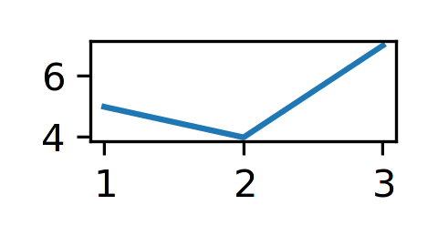

Backend: ``matplotlib``
=======================

The ``matplotlib`` library is a - if not the - classic plotting package in the Python ecosystem. For further details, please consult the `documentation of matplotlib`_. A good basic introduction can also be found in the `Python Data Science Handbook`_ (2016), chapter 4, by `Jake VanderPlas`_. The author has made the `manuscript freely available in the form of Jupyter notebooks on Github`_.

.. _documentation of matplotlib: https://matplotlib.org/contents.html
.. _Python Data Science Handbook: https://www.worldcat.org/search?q=isbn:9781491912058
.. _Jake VanderPlas: https://twitter.com/jakevdp
.. _manuscript freely available in the form of Jupyter notebooks on Github: https://github.com/jakevdp/PythonDataScienceHandbook

.. code:: python

    from bewegung import Video

    v = Video(width = 480, height = 270, seconds = 1.0)

    @v.sequence()
    class Foo:

        @v.layer(
            canvas = v.canvas(
                backend = 'matplotlib',
                facecolor = '#FFFFFFFF',
                dpi = 150,
            )
        )
        def bar(self, canvas): # a matplotlib figure object

            ax = canvas.subplots()
            ax.plot([1, 2, 3], [5, 4, 7])

            return canvas

    v.reset()
    v.render_frame(v.time(0))

Similar to ``matplotlib.pyplot.figure``, the function call ``v.canvas(backend = 'matplotlib')`` accepts the following additional keyword arguments, among others (see documentation of `matplotlib.pyplot.figure`_ and `matplotlib.figure.Figure`_):

.. _matplotlib.pyplot.figure: https://matplotlib.org/api/_as_gen/matplotlib.pyplot.figure.html#matplotlib.pyplot.figure
.. _matplotlib.figure.Figure: https://matplotlib.org/api/_as_gen/matplotlib.figure.Figure.html#matplotlib.figure.Figure

- ``dpi``, resolution or *dots per inch*. 300 by default.
- ``figsize``, a tuple of width and height *in inches*. Width and height of the video by default, converted to inches based on the value of ``dpi``.
- ``width``, width *in pixels*. Mapped to ``figsize`` if provided together with ``height``. Converted to inches based on the value of ``dpi``.
- ``height``, height *in pixels*. Mapped to ``figsize`` if provided together with ``width``. Converted to inches based on the value of ``dpi``.
- ``tight_layout``, by default ``True``.
- ``facecolor``, a background color.
- ``background_color``, mapped to ``facecolor``. Accepts :class:`bewegung.Color` objects.
- ``managed``, a boolean, by default ``True``. This value indicates whether the the ``matplotlib.figure.Figure`` object is "managed" by ``bewegung``. If ``True``, ``bewegung`` will close, i.e. destroy, a figure that is returned by a layer method.

Layer methods are expected to return ``matplotlib.figure.Figure`` objects.

.. warning::

    By default, ``bewegung`` will "manage" ``matplotlib.figure.Figure`` objects for saving resources, i.e. the returned ``matplotlib.figure.Figure`` objects are automatically closed once returned. This can be avoided by setting ``managed`` to ``False``.

.. _acceleratingmatplotlib:

Accelerating ``matplotlib``
---------------------------

Aside from its rich set of features, ``matplotlib`` is known for its mediocre performance. Not to be confused with ``bewegung``'s backends, ``matplotlib`` also has `different backends for rendering`_. Within ``bewegung``, ``matplotlib`` is automatically configured to use `mplcairo`_, "A (new) cairo backend for Matplotlib". Compared to ``matplotlib``'s own built-in backends, its output quality is significantly better while the rendering speed is also higher. Unfortunately, ``mplcairo`` is just "half" of the story of ``matplotlib`` performance.

.. _mplcairo: https://github.com/matplotlib/mplcairo
.. _different backends for rendering: https://matplotlib.org/faq/usage_faq.html#what-is-a-backend

.. warning::

    If ``mplcairo`` can not be installed or is not present for whatever reason, ``bewegung`` will show a warning and fall back to ``matplotlib``'s internal ``cairo`` backend.

In animation frameworks for ``matplotlib``, such as the "official" `matplotlib.animation`_ sub-package, it is common practice to re-use and update existing figure and subplot / axes objects. This speeds up the rendering process considerably. This strategy is also supported by ``bewegung``.

.. warning::

    For optimal results, the suggested approach requires some deeper understanding of ``matplotlib``'s facilities.

The following code illustrates the approach.

.. _matplotlib.animation: https://matplotlib.org/api/animation_api.html

.. code:: python

    from bewegung import Video

    v = Video(width = 480, height = 270, seconds = 1.0)

    @v.sequence()
    class Foo:

        def __init__(self):

            self._fig = v.canvas(
                backend = 'matplotlib',
                facecolor = '#FFFFFFFF',
                dpi = 150,
                managed = False, # ensure that bewegung does not close figure
            )() # calls the factory once, generates a single figure
            self._ax = self._fig.subplots() # generates a single subplot

        @v.layer() # no backend configuration required
        def bar(self): # no canvas requested

            self._ax.clear() # optional: update content directly instead
            self._ax.plot([1, 2, 3], [5, 4, 7]) # draw new content or change old content

            return self._fig

    v.reset()
    image0 = v.render_frame(v.time(0))
    image1 = v.render_frame(v.time(1))

The less a figure changes, the faster the above code becomes. Depending on the degree of complexity and optimization, anything from a few percent to an order of magnitude of performance gain can be achieved.
