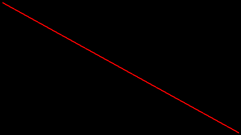

Backend: ``Pillow``
===================

Because ``bewegung`` is literally built around ``Pillow``, the ``Pillow`` backend is by far the most simple one in the collection. For further details, please consult the `documentation of Pillow`_.

.. _documentation of Pillow: https://pillow.readthedocs.io

.. code:: python

    from PIL import ImageDraw
    from bewegung import Video

    v = Video(width = 480, height = 270, seconds = 1.0)

    @v.sequence()
    class Foo:

        @v.layer(canvas = v.canvas(backend = 'pillow'))
        def bar(self, canvas): # a Pillow Image, mode RGBA

            draw = ImageDraw.Draw(canvas)
            draw.line(
                ((5, 5), (v.width - 5, v.height - 5)),
                fill = (255, 0, 0, 255), width = 3,
            )

            return canvas

    v.reset()
    v.render_frame(v.time(0))

Similar to ``PIL.Image.new``, the function call ``v.canvas(backend = 'pillow')`` accepts the following additional keyword arguments:

- ``mode``, by default ``'RGBA'``. If a format other than ``'RGBA'`` is specified, the user has to convert the Image to ``'RGBA'`` before returning it from the layer method.
- ``size``, a tuple of width and height. Width and height of the video by default.
- ``color``, a background color. Uses ``Pillow``'s default, black.
- ``width``, mapped to ``size`` if provided together with ``height``.
- ``height``, mapped to ``size`` if provided together with ``width``.
- ``background_color``, mapped to ``color``. Accepts ``bewegung.Color`` objects.
