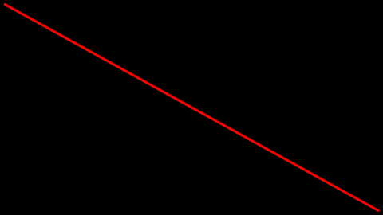

.. _backendcairo:

Backend: ``pycairo``
====================

The ``pycairo`` backend allows to generate pre-configured ``ImageSurface`` objects, see `pycairo documentation`_.

.. _pycairo documentation: https://pycairo.readthedocs.io/en/latest/reference/surfaces.html?highlight=ImageSurface#cairo.ImageSurface

.. code:: python

    import cairo
    from bewegung import Video

    v = Video(width = 480, height = 270, seconds = 1.0)

    @v.sequence()
    class Foo:

        @v.layer(canvas = v.canvas(backend = 'cairo'))
        def bar(self, canvas): # a pyrairo ImageSurface, mode ARGB32

            ctx = cairo.Context(canvas)

            ctx.move_to(5, 5)
            ctx.line_to(v.width - 5, v.height - 5)
            ctx.set_source_rgba(1, 0, 0, 1)
            ctx.set_line_width(3)
            ctx.stroke()

            return canvas

    v.reset()
    v.render_frame(v.time(0))

Similar to ``cairo.ImageSurface``, the function call ``v.canvas(backend = 'cairo')`` accepts the following additional keyword arguments:

- ``format``, by default ``cairo.FORMAT_ARGB32``. If a format other than ARGB32 is specified, the layer method is supposed to return a Pillow Image object of mode ``'RGBA'`` instead of an ``ImageSurface`` object, i.e. in this case the conversion to Pillow's image format is left to the user. Alternatively, the user may also convert the non-ARGB32 ``ImageSurface`` object to an ARGB32 ``ImageSurface`` object before returning it from the layer method.
- ``width``, width of the video by default
- ``height``, height of the video by default
